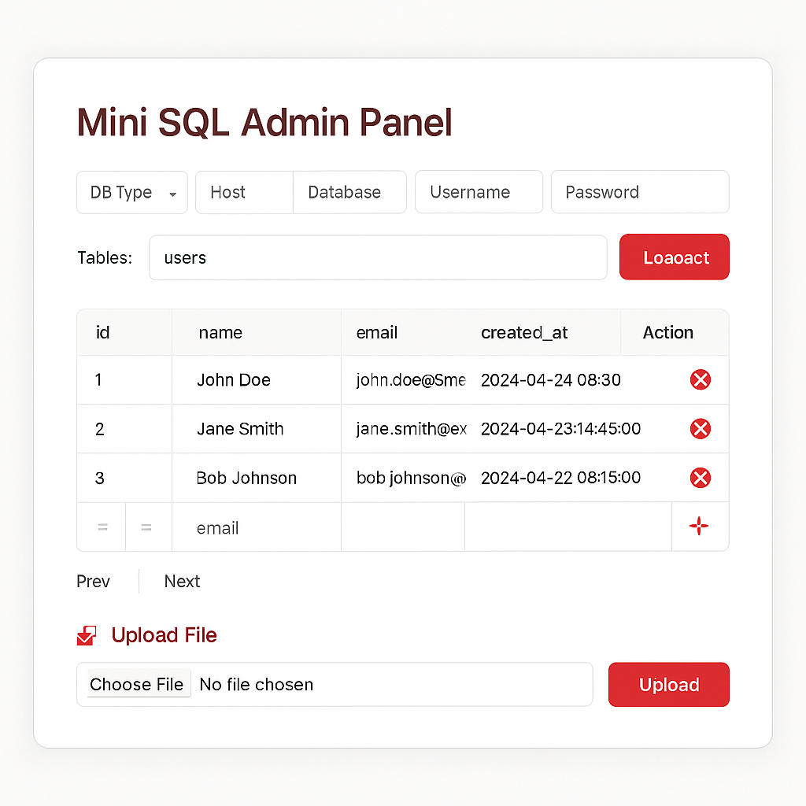

# ⚙️ Mini SQL Admin – For MySQL (PHP Single File Admin Panel)

A blazing fast, modern, and lightweight **MySQL database admin panel** built with PHP and Bootstrap.  
No dependencies. Just upload one PHP file and start managing your database via AJAX.

---

## 🚀 Key Features

- ✅ **MySQL-only** support (via PDO)
- ✅ **Inline editing** with textarea for JSON/long content
- ✅ **Insert / Delete rows** directly
- ✅ **Paginated view** (100 rows per page)
- ✅ **Instant AJAX response** (no reloads)
- ✅ **Modern light theme** UI
- ✅ **Fully responsive** (mobile/tablet/desktop)
- ✅ **100% single PHP file**

---

## 📦 How to Use

1. Upload `mini-sql-admin.php` to your server (public or local).
2. Open it in your browser.
3. Enter your MySQL credentials.
4. Select a table, browse, edit, insert or delete data instantly.

No setup. No database config files. No composer.

---

## ⚙️ Requirements

- ✅ PHP 7.4 or higher
- ✅ `pdo_mysql` extension enabled
- ✅ MySQL server (local or remote)

---

## 🔐 Security Warning

> ⚠️ This panel has no built-in authentication.

- Use `.htaccess`, IP whitelist, VPN, or host it locally.
- Recommended for **local development, staging or internal use** only.
- Use with caution on production environments.

---

## 💡 Why Use Mini SQL Admin?

- You don’t want to install phpMyAdmin
- You need a fast tool on shared hosting
- You want a single-file MySQL control panel
- You need inline editing without refresh
- You want to embed a custom DB viewer on a dev tool

---

## 📄 License

MIT License © 2025  
Built by [privdayz.com](https://privdayz.com/)
<!-- Place in <head> for SEO optimization -->
<meta name="description" content="Mini SQL Admin is a fast and lightweight single-file PHP MySQL database manager. Supports inline editing, AJAX, upload and pagination. No login required.">
<meta name="keywords" content="mysql admin panel php, single file mysql admin, php mysql ajax manager, mysql database manager, php db viewer, mini sql admin, mysql edit panel php">
